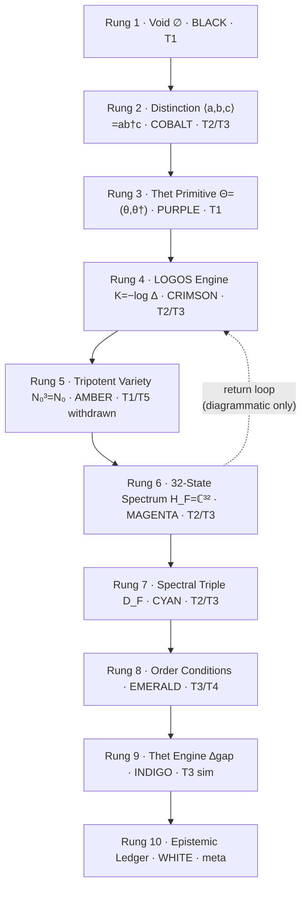
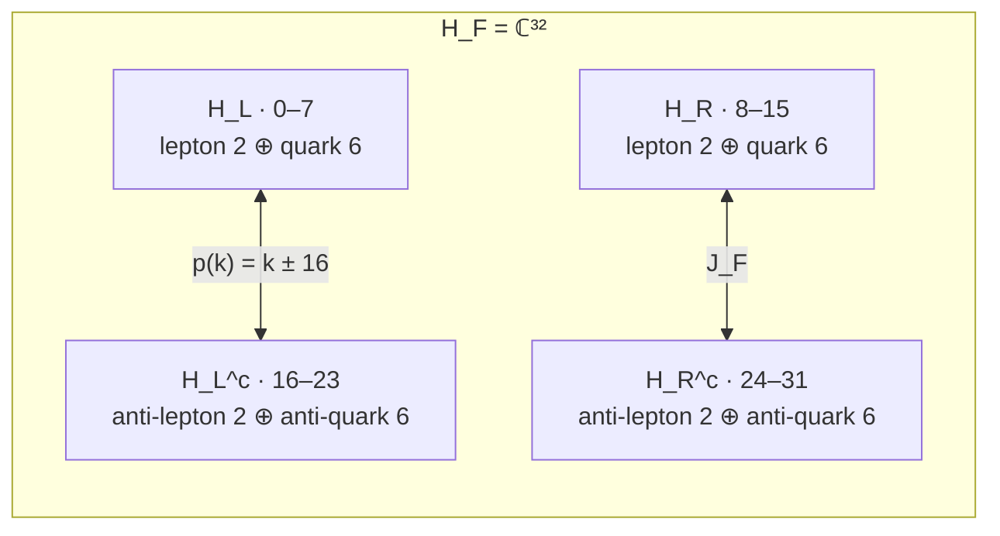
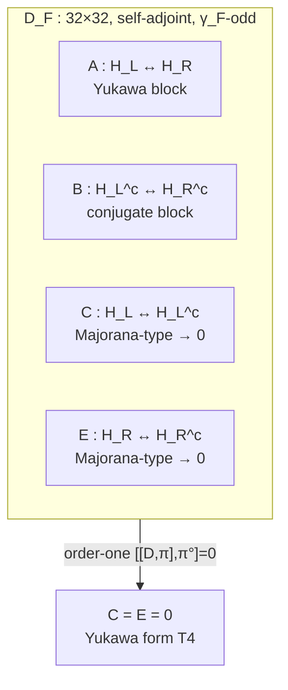
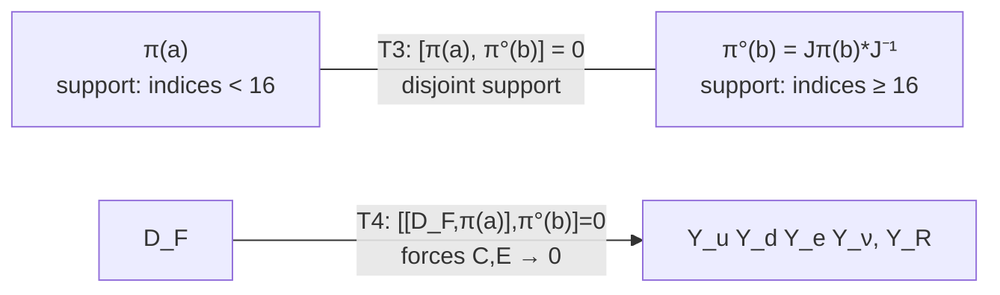
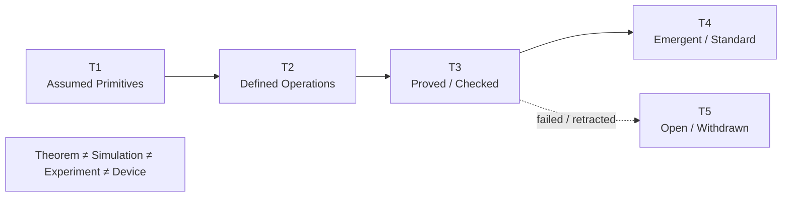
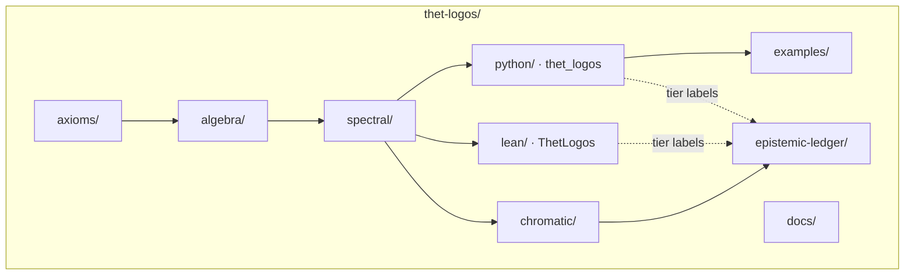

# Diagrams

## The 10-rung chromatic ladder (organizational device)

> The ladder is an organizational/mnemonic device, not a formalized
> Möbius-bundle construction (Framework §2).

## The 32-state block structure

## D_F block matrix (Framework eq. 2)

## Order-zero vs order-one

## Epistemic flow

## Repository map

