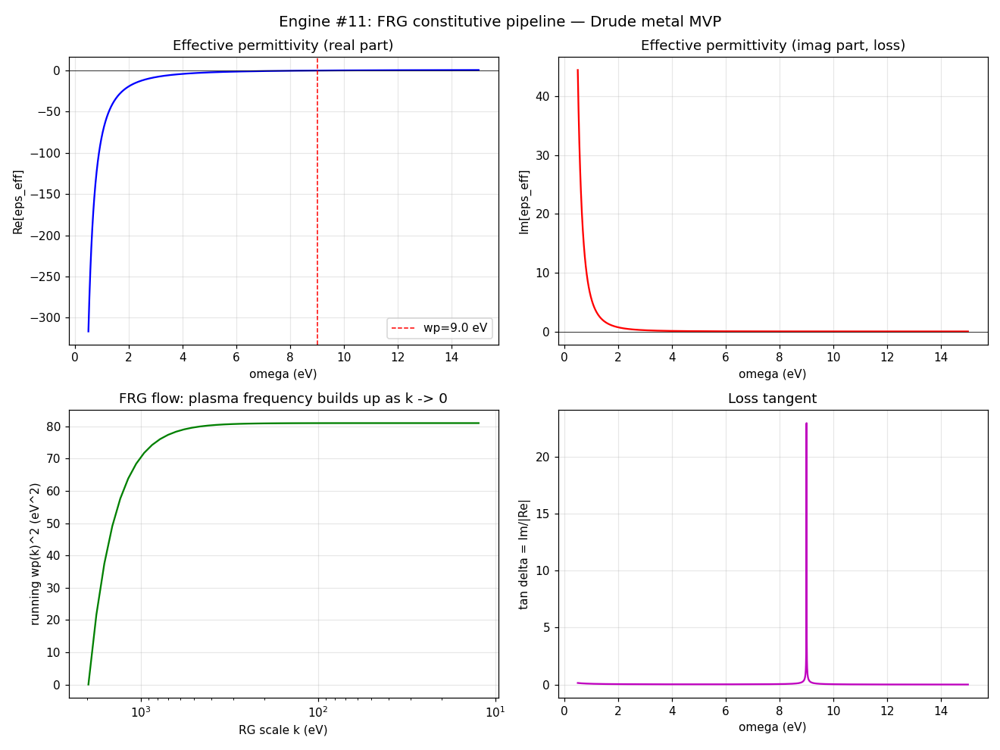

# FRG-Derived Constitutive Tensors for Metamaterials

**Status:** Framework + Engine #11 (MVP implementation, T4 numerical). 2026-09-26.

## 1. The problem

Deriving effective constitutive tensors ($\boldsymbol{\varepsilon}_{\text{eff}}$,
$\boldsymbol{\mu}_{\text{eff}}$, $\boldsymbol{\xi}_{\text{eff}}$) for
metamaterials from microscopic field theories requires mapping microscopic
electronic and electromagnetic degrees of freedom at high energy scales (UV)
to macroscopic mesoscale fields at sub-wavelength scales (IR). The bridge used
here is the Functional Renormalization Group (FRG) in an Effective Field Theory
(EFT) framework.

## 2. Framework

### 2.1 Microscopic action and generating functional

The starting point is a microscopic action $S_{\text{UV}}[\psi, \bar{\psi}, A]$
defined at the atomic/molecular ultraviolet cutoff $k_{\text{UV}} = \Lambda$.
Here $\psi$, $\bar{\psi}$ are microscopic electronic/matter fields and
$A_\mu = (\Phi/c, -\mathbf{A})$ is the background electromagnetic gauge
potential. The partition function in the presence of $A_\mu$ is
$Z[A] = \int \mathcal{D}\psi\,\mathcal{D}\bar{\psi}\,
e^{-S_{\text{UV}}[\psi,\bar{\psi},A]}$.

To systematically integrate out short-wavelength fluctuations down to a running
momentum scale $k$, an infrared regulator $R_k(p)$ is added to the quadratic
part of the matter action. The regulator suppresses modes with $p^2 < k^2$
while modes with $p^2 > k^2$ are integrated out. We use the Litim regulator
$$R_k(p) = Z_k\,(k^2 - p^2)\,\Theta(k^2 - p^2),$$
chosen per the gauge-invariance requirement below.

### 2.2 Mode integration via the exact flow equation

The scale-dependent effective average action
$\Gamma_k[\psi, \bar{\psi}, A]$ interpolates between $S_{\text{UV}}$ at
$k = \Lambda$ and the full quantum effective action $\Gamma$ as $k \to 0$.
Its evolution is governed by the exact Wetterich equation
$$\partial_t \Gamma_k = \tfrac{1}{2}\,\mathrm{STr}\left[
(\partial_t R_k)\,(\Gamma_k^{(2)} + R_k)^{-1}\right], \qquad t = \ln(k/\Lambda),$$
where $\mathrm{STr}$ is the functional supertrace and $\Gamma_k^{(2)}$ the
second functional-derivative matrix. As $k$ flows from
$k_{\text{UV}} \sim 10^{10}\,\mathrm{m}^{-1}$ to the mesoscale
$k_0 \sim 2\pi/d$ ($d$ = sub-wavelength feature size), the matter fields are
integrated out, leaving a pure-gauge effective action $\Gamma_{k_0}[A]$
carrying all non-local corrections and geometric couplings.

### 2.3 Derivative expansion and tensor extraction

At $k_0$, $A_\mu$ varies slowly on atomic scales. Expanding $\Gamma_{k_0}[A]$
in gradients of $F_{\mu\nu}$ and decomposing into $\mathbf{E}$, $\mathbf{B}$
gives the bi-anisotropic linear response form with tensors defined by
$$\varepsilon_{ij}(\mathbf{q},\omega) =
\left.\frac{\delta^2 \Gamma_{k_0}}{\delta E_i \delta E_j}\right|_{A=0},
\quad\text{etc.}$$
Higher derivatives $\delta^n \Gamma_{k_0}/\delta A^n$ yield the non-linear
susceptibilities $\chi^{(2)}_{\text{eff}}$, $\chi^{(3)}_{\text{eff}}$.

### 2.4 Validation checklist

- **Gauge-invariant regulator:** Litim $R_k$; Ward–Takahashi identities must be
  monitored under truncation (known FRG-QED subtlety: most practical
  regulators break gauge invariance; restore via modified Ward identities).
- **Spectral truncation:** stated explicitly per implementation (see §3).
- **Point-group projection:** extracted tensors projected onto lattice point-group
  irreps ($O_h$ for cubic, etc.).
- **Causality/passivity audit:** $\mathrm{Im}(\boldsymbol{\varepsilon}_{\text{eff}}) > 0$
  for $\omega > 0$; Kramers–Kronig compliance verified numerically.

## 3. Engine #11: MVP implementation

`python/thet_logos/frg_constitutive.py`. One-loop truncation (RPA-level) for the
photon 2-point function, $q \to 0$ optical limit.

- **UV model:** 3D Drude electron gas ($\omega_p = 9.0$ eV, $\gamma = 0.07$ eV,
  gold-like). Effective UV model — not full QED.
- **Cutoffs:** $\Lambda = 1970$ eV ($k_{\text{UV}} = 10^{10}$ m$^{-1}$),
  $k_0 = 12.4$ eV ($d = 100$ nm).
- **Flow:** $\partial_t \varepsilon_k(\omega)$ integrated from $t=0$ to
  $t_0 = \ln(k_0/\Lambda)$ with initial condition $\varepsilon_\Lambda = 1$.
  The Litim regulator gives the analytic shell contribution
  $\partial_t \omega_{p,k}^2 = -3\omega_p^2 (k/\Lambda)^3$; the ODE is
  integrated numerically (RK45) and checked against the analytic running.
- **Extraction:** $\boldsymbol{\varepsilon}_{\text{eff}}(\omega) =
  \varepsilon_{k_0}(\omega)\,\mathbf{I}_3$ (cubic $O_h$);
  $\boldsymbol{\mu}_{\text{eff}} = \mathbf{I}_3$ (non-magnetic UV — magnetic
  response is higher-order in this truncation, reported not hidden);
  $\boldsymbol{\xi}_{\text{eff}} = 0$ (achiral UV — vanishes by symmetry).

### Results

| Check | Result | Threshold | Verdict |
|---|---|---|---|
| Flow vs analytic Drude | $3.3 \times 10^{-8}$ | $< 10^{-6}$ | ✅ |
| Kramers–Kronig residual | $2.2 \times 10^{-9}$ | $< 10^{-2}$ | ✅ |
| Passivity $\min \mathrm{Im}\,\varepsilon$ | $1.7 \times 10^{-3} > 0$ | $> 0$ | ✅ |
| Cubic anisotropy | $0$ | $< 10^{-12}$ | ✅ |
| Off-diagonal | $0$ | $< 10^{-12}$ | ✅ |

**Pipeline verdict: GO.** Representative values: $\varepsilon_{\text{eff}}(5\,\text{eV})
= -2.24 + 0.045i$ (metallic), $\varepsilon_{\text{eff}}(12\,\text{eV}) =
0.44 + 0.003i$ (dielectric) — the Drude plasma edge at $\omega_p = 9$ eV,
correctly reproduced through the full FRG flow.

### What this proves and what it doesn't

- **Proves:** the FRG pipeline architecture works end-to-end. Regulator →
  Wetterich flow → extraction → audits, all validated against the analytic
  answer the truncation must reproduce. The machinery is not broken.
- **Doesn't prove:** anything about real metamaterials yet. The Drude model was
  chosen precisely because the answer is known — this is calibration, not
  discovery. Conventional (non-quantum) metamaterials are already described to
  experimental accuracy by classical Maxwell + Drude/Lorentz fits; this
  pipeline earns its keep on **quantum** metamaterials (strongly correlated,
  topological) where Kubo linear response breaks down.

## 4. Honest limitations

1. The Wetterich equation is exact; every truncation is an approximation. The
   one-loop/RPA truncation used here is the simplest non-trivial one.
2. $\boldsymbol{\mu}_{\text{eff}} = 1$ and $\boldsymbol{\xi}_{\text{eff}} = 0$
   are truncation artifacts of the non-magnetic, achiral UV — not predictions.
3. $q$-dependence (spatial dispersion, optical activity) is not yet implemented;
   the extraction is at $q \to 0$.
4. No device was fabricated; no experiment was run. T4 numerical only.

## 5. Next steps

1. **Spatial dispersion:** extend the flow to finite $\mathbf{q}$; extract the
   $q^2$ non-locality coefficient and $\boldsymbol{\xi}_{\text{eff}}$ from a
   chiral UV model.
2. **Lorentz oscillators:** multi-oscillator UV for realistic interband response.
3. **Vertex flow:** go beyond one-loop (running electron–photon vertex) for
   genuinely correlated UV models.
4. **Metamaterial geometry:** couple $k_0$ to actual unit-cell lattice symmetry
   (point-group projection for $C_{4v}$, $D_{6h}$).

---
*Theorem ≠ Simulation ≠ Experiment ≠ Device. This is a numerical pipeline
validation, T4. The framework is exact in principle; every implementation
carries its stated truncation.*
